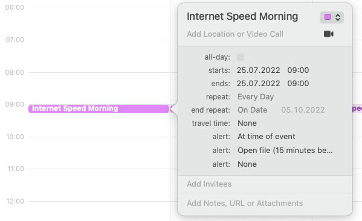

# Internet Speed

## What
Project to automatically measure and store my local internet speed performance. 

## Why: 
Internet providers oversell / over-promise compared to what they actually deliver. A good example is german "Kabel" internet which is promised to have 50 mbits up and 1000 mbits down (my contract and expectation). However. People never really measure what's actually being delivered. 

_"As long as it works, it works."_

The results of this however, is that - first of all, you pay a price that's way too high - and secondly - what bothered me the most! - internet providers do not have an incentive to actually improve their services but are doing well with providing bad services. Meaning, many outages and super low bandwidth that's being shared with many other people. So the expected 1000 mbits often reduced to less than **30!** once people started to watch 4K Netflix series in the evening.

As a result of all that I needed to cancel video calls for work or had my SQL queries crash / time out when working late (which I almost always did)

### Outcome: 

I scheduled this script on my Mac locally using mac OS Automator, zsh and python to have a record of upload / download / ping performance. I could use this records to argue with the internet provider helping me to get refunds for when performance was below - I think 60% - of their promise. After a couple of months I could use it to get out of the 24 months contract entirely. 

## How it works. 

Workflow: 

1. I needed to measure the performance locally, so any service-side or vm implementations or alike would not work. I solved this creating an application in macOS ``Automator`` 
2. The Automator app executes the python script on the command line using ``schedule.zsh`` and is **scheduled to run 3x a day** (morning / noon / evening), simply creating a repeating `iCal` event in my calendar.
</img>

1. Results are stored in the `internet_speeds_dataset.csv` and uploaded to github immediately
2. 

Tech Stack: 


```Python
# https://github.com/sivel/speedtest-cli
import speedtest as st
import pandas as pd
from datetime import datetime


def get_new_speeds():
    speed_test = st.Speedtest()
    speed_test = st.Speedtest()
    speed_test.get_best_server()

    # Get ping (milliseconds)
    print("Getting ping (milliseconds)")
    ping = speed_test.results.ping
    ping = round(ping, 0)  # round ping
    print(ping)
    # Perform download and upload speed tests (bits per second)
    print("Perform download and upload speed tests ...")
    download = speed_test.download()
    download_mbs = round(download / (10**6), 2)  # convert to mbits
    print("Download: ", download_mbs, " Mbits")
    upload = speed_test.upload()
    upload_mbs = round(upload / (10**6), 2)  # convert to mbits
    print("Upload: ", upload_mbs, " Mbits")

    return (ping, download_mbs, upload_mbs)


def update_csv(internet_speeds):
    # Get today's date in the form Month/Day/Year
    date_today = datetime.today().strftime("%m/%d/%Y/%H:%M:%S")
    print(date_today, "Writing data to csv file ...")
    # File with the dataset
    csv_file_name = "internet_speeds_dataset.csv"

    # Load the CSV to update
    try:
        csv_dataset = pd.read_csv(csv_file_name, index_col="Date")
    # If there's an error, assume the file does not exist and create\
    # the dataset from scratch
    except:
        csv_dataset = pd.DataFrame(
            list(),
            columns=["Ping (ms)", "Download (Mb/s)", "Upload (Mb/s)"]
        )

    # Create a one-row DataFrame for the new test results
    results_df = pd.DataFrame(
        [[ internet_speeds[0], internet_speeds[1], internet_speeds[2] ]],
        columns=["Ping (ms)", "Download (Mb/s)", "Upload (Mb/s)"],
        index=[date_today]
    )

    updated_df = csv_dataset.append(results_df, sort=False)
    # https://stackoverflow.com/a/34297689/9263761
    updated_df\
        .loc[~updated_df.index.duplicated(keep="last")]\
        .to_csv(csv_file_name, index_label="Date")


new_speeds = get_new_speeds()
update_csv(new_speeds)

```